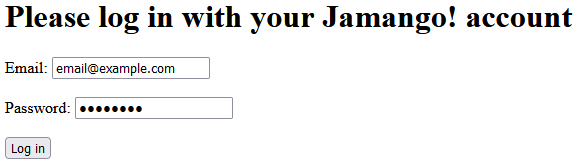
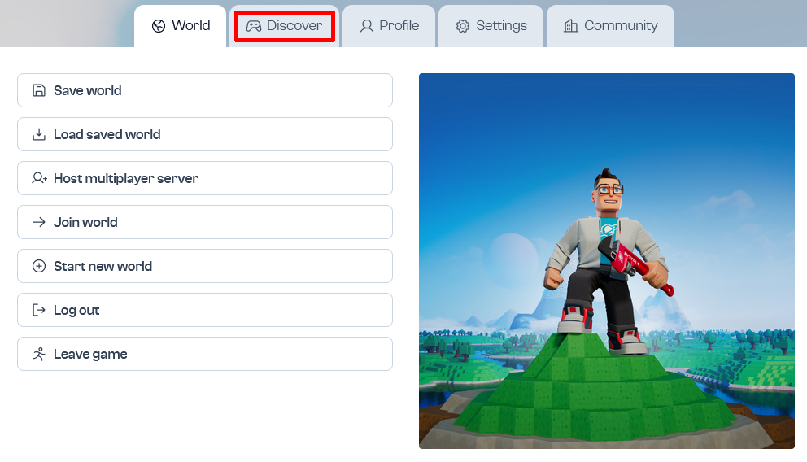
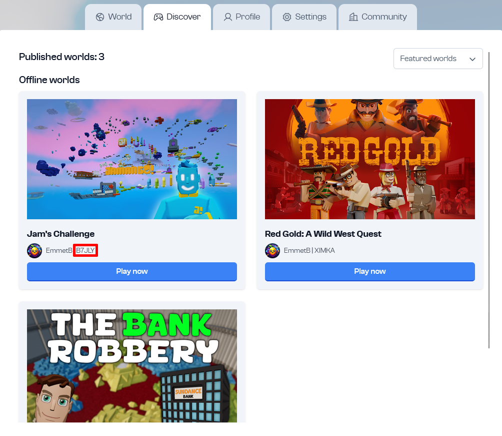
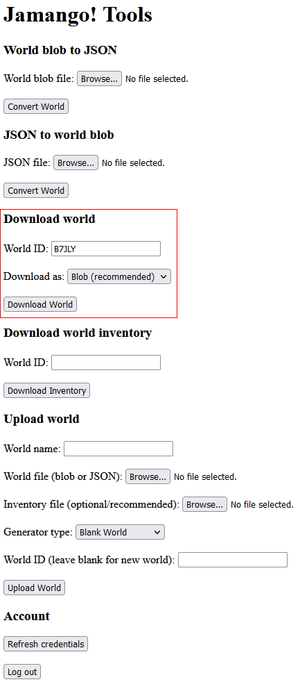
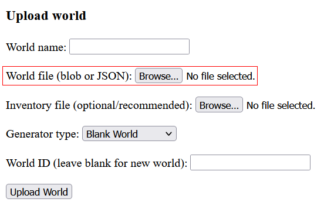
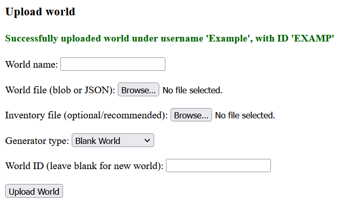

# JTools - The Jamango! World Editor

A collection of tools for editing Jamango! worlds.

## Build instructions

First, clone this repository to your local machine using `git clone https://github.com/ChegV/JTools` or [GitHub Desktop](https://desktop.github.com/).

[MAMP](https://www.mamp.info/en) is recommended to host the interface. Make sure to set the server to use PHP 8.1.0 or greater.

If you want a lightweight instance, use [PHP](https://www.php.net/) 8.1.0 or greater and install the cURL library for PHP. Then open a terminal in the JTools directory. With the built-in PHP webserver, use `php -c . -S localhost:80` and open [localhost](http://localhost) on your machine.

## How to use

JTools can download, copy, convert, upload, and overwrite Jamango! worlds.\
JTools requires user login to interface with Jamango! servers.
You can also find a demo video [here](demo.mp4).

### Logging in

Open your browser to [localhost](http://localhost).\
Find your email and password for Jamango! and enter them into the interface.

### Downloading worlds

After logging in, we can now download worlds that either you own or are publically available. Downloading a private world will not work as you do not own it.

To download a world, navigate to the [homepage](https://jamango.io) or the "Load a world" interface. For our example, we will be using [Jam's Challenge](https://jamango.io/game/B7JLY).

The first thing we will need is the world ID. This can be copied in two main ways:

- URLS
- In-game

We recommend using the in-game interface for this example, but one way you can find world IDs is via the URL, such as https://jamango.io/game/B7JLY for Jam's Challenge. As you can see, the world ID for Jam's challenge is B7JLY. The most easiest way to find IDs though is via the in-game interface.

First, open any world (this also includes public worlds).\
For our example, we will navigate to the "Discover" tab.

After navigating to the "Discover" tab, we can see the world IDs of published worlds.\
In the screenshot below, we can see the ID for our current example.

Copy the world ID and navigate to the main dashboard of JTools.\
In the main dashboard, enter the world ID in the "Download World" section.

If you noticed, we have a pulldown for two download options, either blob or JSON.\
We recommend using blob to download files as they are smaller in size compared to JSON.\
Once ready, press the "Download World" button and save the world file binary.

For our example, you should now have a file named "B7JLY.bin" downloaded.

### Uploading worlds

After downloading the world, we will now upload it to your account.\
For our example we will upload our copy of Jam's Challenge to our account.

First, navigate to the dashboard and upload the world file binary to the location in the screenshot below.

After uploading the world file, we can name the world and fill out other inputs.\
Generator types are very important, as the world was either generated in the terrain form or the blank form.\
Getting these wrong will cause the world to freeze the game.

World IDs are helpful for things like importing and overwriting.\
Using a world ID in the upload will let you overwrite an existing world ID and replace all assets and world data on the ID. Make sure you know what you're doing before you overwrite the ID!

Inventory files aren't very important, but is an option. They contain the user's inventory and can be used to save custom objects from your worlds. Inventory files can only be downloaded from worlds you own and will fail to download inventories from other worlds, including published worlds.

World names are important and cannot be left empty, they name the world.\
Since worlds are based on ID, you can name them anything you want, including making duplicate names.

After filling out all of the required fields, you can now upload the world. Press the "Upload World" button and wait for the confirmation of upload. A screenshot below shows a successful upload.

You should now see the uploaded world in your current list of worlds under the name you set.\
Enjoy JTools!

### Account

On the bottom of the dashboard are two buttons, the "Refresh credentials" and "Log out" buttons.\
If at any point you're uploading and you receive an expired token error, you can refresh credentials by pressing the likewise button.\
The "Log out" button is self-explanatory.

## Extras

JTools was developed by CeghV and documented by PaddockBux.
